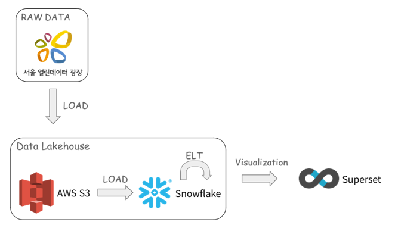
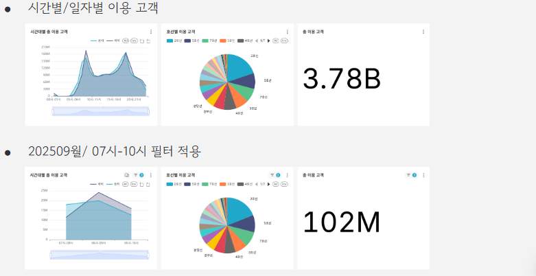
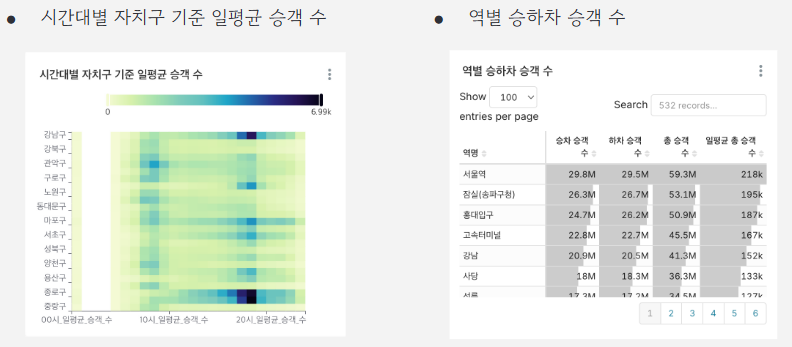
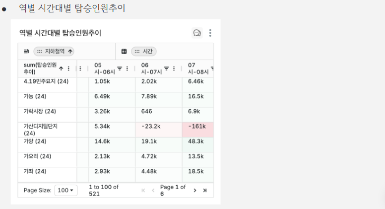
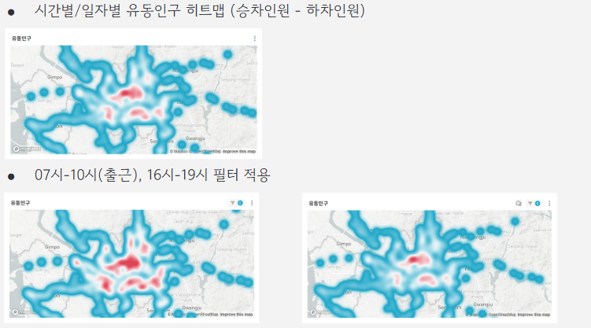
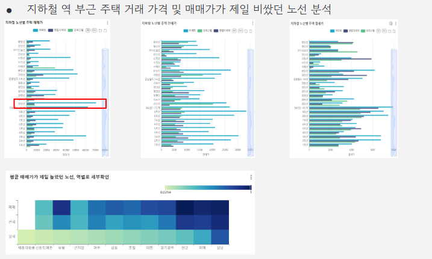
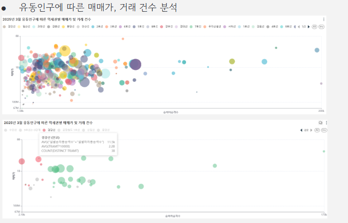
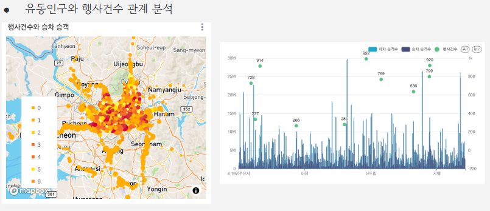

# Seoul-Subway-Insight🚇
프로젝트 주제: 서울 지하철 공공데이터를 이용한 시각화 및 대시보드

프로젝트 기간: 25.10.27 ~ 25.10.30

문선유, 김민국, 김성렬, 김예원

## 📝 분석 배경 및 목적

서울시 지하철은 하루 백만명 이상이 이용하는 대중교통으로 혼잡 관리, 효율적인 운영이 중요하다. 이를 위해 지하철 이용객들의 정보와 관련된 인사이트를 얻고자 했다.
공공데이터로 제공되는 지하철 관련 정보(승하차, 사건사고, 인근 지역정보 등)를 시각화 하여 운영자와 일반 시민이 쉽게 이해하고 체계적으로 분석할 수 있는 기반을 만들고자 했다.

### 프로젝트의 분석 주제
지하철 이용객의 시간대별 승하차 정보, 사건 사고 정보, 부동산 및 축제 관련 데이터를 조합해 이동 경향, 생활환경에 미치는 영향, 인근 지역 활성 정도를 파악한다.

1. **시간대별/일자별 승하차 정보를 활용한 유동인구 분석**
    * 시간대별 자치구 기준 일평균 승객수
    * 역별 승하차 승객수
    * 역별 시간대별 탑승 인원추이
    * 시간별/ 일자별 유동인구 히트맵

2. **시간대별 승하차 정보 및 그에 따른 지하철 사고 건수 분석**
    * 5년 내 월별 지하철 사고 유형 비율
    * 시간대별 사고 유형과 평균 승하차 인원

3. **유동인구와 부동산 거래 가격 및 빈도 비교 분석**
    * 지하철 역 부근 주택 거래 가격 비교
    * 평균 매매가가 제일 높았던 노선, 역별로 세부확인
    * 유동인구에 따른 매매가, 거래 건수 분석

4. **유동인구와 행사와의 관계 분석**
    * 행사 건수와 승차 승객 관계 분석

## 📶 사용 데이터
<b>서울 열린데이터 광장

> [서울시 역사마스터 정보](https://data.seoul.go.kr/dataList/OA-21232/S/1/datasetView.do)
>
> [서울시 지하철 호선별 역별 승하차 인원 정보](https://data.seoul.go.kr/dataList/OA-12914/S/1/datasetView.do)
>
> [서울시 지하철 호선별 역별 시간대별 승하차 인원 정보](https://data.seoul.go.kr/dataList/OA-12252/S/1/datasetView.do)
>
> [서울시 문화행사 정보](https://data.seoul.go.kr/dataList/OA-15486/S/1/datasetView.do)

<b>국가교통 데이터 오픈마켓

> [역세권 공동주책 실거래 정보](https://www.bigdata-transportation.kr/frn/prdt/detail?prdtId=PRDTNUM_000000020052) 
><i>(* 본 프로젝트에서 사용한 테이블은 용량 제한으로 인해 업로드 하지 않음)</i>

## 🔨 사용 기술 및 프레임워크

|Step|Tool|Detail|
|---|---|---|
| Data collection | CSV | 
| Data preprocessing | Python, Pandas | 지하철 역명을 비롯한 표기 일치화 |
| Data Lake | AWS S3 | Raw data 적재 |
| Data Warehouse | Snowflake | SQL을 활용한 테이블 생성 및 관리 |
| Dashboard (Visualization) | Preset | 대시보드 생성 및 그래프와 지도를 활용한 시각화 |

## 🌊 프로젝트 흐름도

    

## 📊 프로젝트 결과

    

    

    

    

    

    

    

